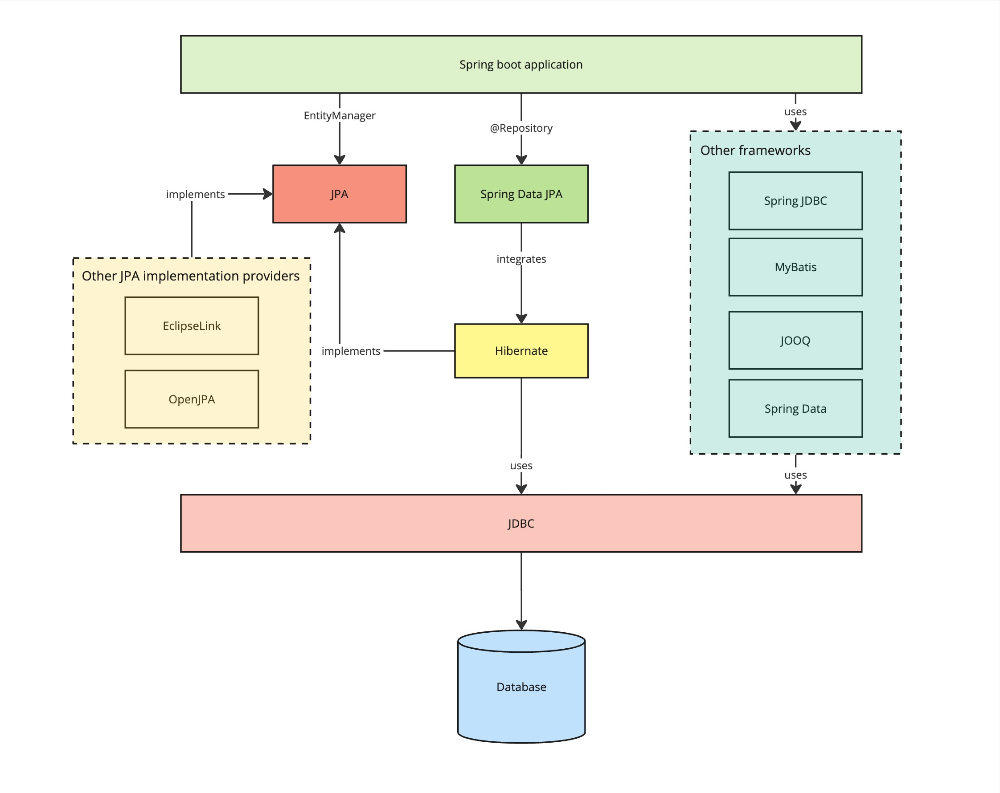

# Data Access Technologies




## Configuration Properties

```yaml
spring:
  application:
    name: spring-data-jpa-hibernate

  datasource:
    driver-class-name: org.postgresql.Driver
    url: jdbc:postgresql://localhost:5432/illustrator_db?currentSchema=illustrator
    username: postgres
    password: password

  jpa:
    open-in-view: false
    show-sql: true
    properties:
      hibernate:
        format_sql: true
    hibernate:
      ddl-auto: validate

  sql:
    init:
      mode: always
```

## Spring Data JPA

```java
@Service
@RequiredArgsConstructor
@Slf4j
public class ItemServiceV1Impl implements ItemService {

    private final ItemRepository itemRepository;

    @Transactional
    @Override
    public void increaseAmount(final Long id, final Long amount) {
        var item = itemRepository.findById(id)
                .orElseThrow();
        item.addAmount(amount);
        var updatedItem = itemRepository.save(item);
        log.info("current amount updated_amount={} of id id={}", updatedItem.getAmount(), id);
    }
}
```

```java
@Service
@RequiredArgsConstructor
@Slf4j
public class ItemServiceV2Impl implements ItemService {

    private final EntityManager entityManager;

    @Transactional
    @Override
    public void increaseAmount(final Long id, final Long amount) {
        var item = Optional.ofNullable(entityManager.find(Item.class, id))
                .orElseThrow();
        item.addAmount(amount);
        var updatedItem = entityManager.merge(item);
        log.info("current amount updated_amount={} of id id={}", updatedItem.getAmount(), id);
    }
}
```

## Hibernate

```java
@Service
@RequiredArgsConstructor
@Slf4j
public class ItemServiceV3Impl implements ItemService {

    private final SessionFactory sessionFactory;

    @Override
    public void increaseAmount(final Long id, final Long amount) {

        Transaction transaction = null;

        try (var session = sessionFactory.openSession()) {

            transaction = session.beginTransaction();

            var item = Optional.ofNullable(session.find(Item.class, id))
                    .orElseThrow();
            item.addAmount(amount);
            session.merge(item);

            transaction.commit();

            log.info("current amount updated_amount={} of id id={}", item.getAmount(), id);
        } catch (Exception e) {
            if (transaction != null) {
                transaction.rollback();
            }
            throw e;
        }
    }
}
```

##